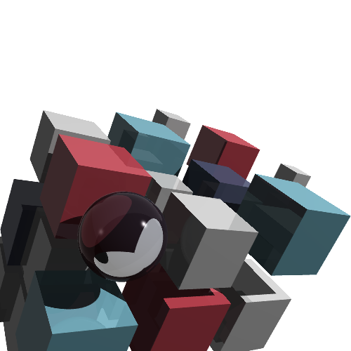
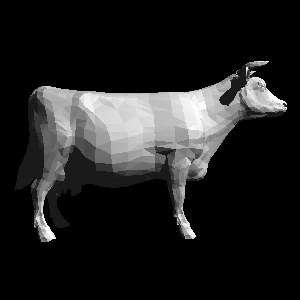
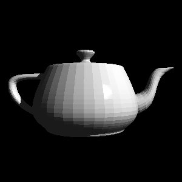
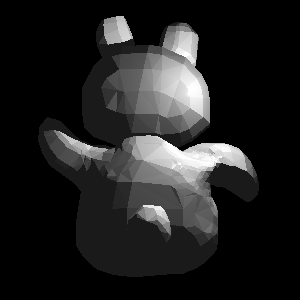
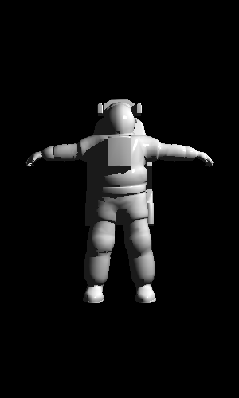

# Python Ray Tracer

[From `The Ray Tracer Challenge` by Jamis Buck](http://raytracerchallenge.com/)

  

The idea is to go through the book using `Python 3.14` as the main development language
and `Pytest` for the test suite. For the remainder of the toolchain, the plan is to
test-drive `Pyrefly` for the language server/type checker and `ruff` for linting. `uv`
is used as the package manager.

## Current Features Supported
* __Parallel rendering__
  When calling the camera.render(world) method, there's now a new boolean parameter to allow for
  parallel processing during the rendering process.  This defaults to `False` so everything will
  run in a single process.  Setting to `True` will cause the renderer to break the image into 64x64
  pixel chunks and render each of these in separate processes.  Testing on my 8-Core machine, this
  brings the cover image render time from 11m 16s down to 2m +/- a second or two.

* __Primitive mathematical objects__:
  * Cone
  * Cube
  * Cylinder
  * Plane
  * Sphere
  * Triangle (faceted _and_ smoothed)

* __CSG Operations on objects__
  * Union
  * Difference
  * Intersection
  
* __Object Groups__ with common transformations - allows for complex objects to be 
constructed from primitives

* __Alias/Wavefront .OBJ loading__ format files

* __Bounding Volume Hierarchies in meshes__
  Optimisation of triangle meshes/groups to allow for more efficient rendering (For example,
  the following images exhibit a 100x improvement in render time over using the unoptimized meshes):

  
  
  

The astronaut below consists of 6381 triangle faces.  This 300x500 image rendered in 17m 41s in single-thread mode and 2m 33s in multi-thread mode.

  

 
* __Basic materials__ including the following 3D patterns:
  * Stripes
  * Rings
  * Simplex Noise
  * 2 Colour Gradient
  * Checkerboard

  Patterns can be blended by way of the 'blend' pattern type which also has a bias control
  allowing the mix between the two patterns to be controlled (default is a 50/50 blend)

  Furthermore, many of the pattern types can be stacked so that rather than using simple colours
  they can include other pattern types instead

* __Lights__
  * Infinite point light

## To-Do:
* ~~Normal smoothing for meshes~~  DONE
* ~~Parallel rendering~~ DONE
* ~~Add support for multiple lights in a scene~~ DONE

* Add different light types (area lights, spotlights, directional lights); with realistic falloff.

* Allow materials to be inherited from parent Objects / Groups (currently there's no
way for loaded object meshes to have materials applied except by applying to each individual
element - which is _incredibly_ inefficient for triangle meshes!)

* Fix cone implementation - there's currently _some_ artifacts become visible within some of the
test scenes

* Simplify the APIs for material/pattern generation